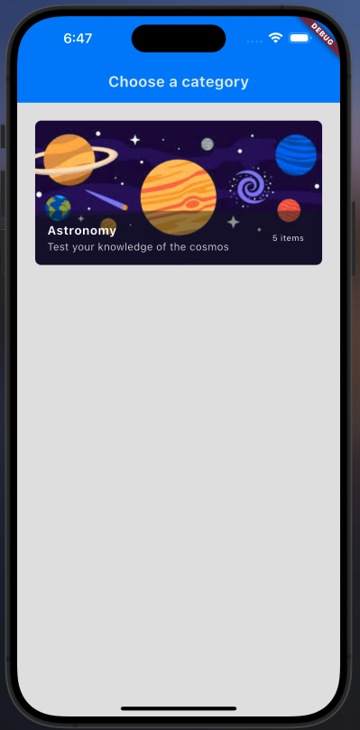
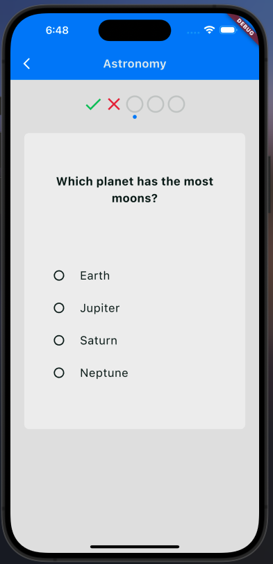
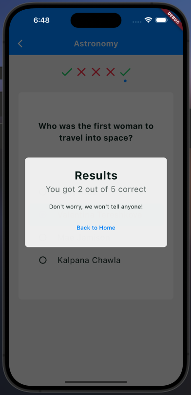

## Description

MyFlutterApp is a powerful tool designed to help users manage their tasks efficiently. It offers a user-friendly interface and a variety of features to enhance productivity.

## Prerequisites

Before you begin, ensure you have met the following requirements:

- You have installed the latest version of [Flutter](https://flutter.dev/docs/get-started/install).
- You have a `Mac` machine with [Xcode](https://developer.apple.com/xcode/) installed for iOS development.
- You have an Android device or emulator for Android development.

## Installation

To install, follow these steps:

1. Clone the repository:
   ```sh
   git@github.com:Grrom/quiz_app.git
   ```
2. Navigate to the project directory:
   ```sh
   cd quiz_app
   ```
3. Get the Flutter dependencies:
   ```sh
   flutter pub get
   ```

## Usage

To use quiz_app, follow these steps:

1. Run the application on an emulator or connected device:

   ```sh
   flutter run
   ```

2. For iOS, ensure you have an iOS simulator or device connected.
3. For Android, ensure you have an Android emulator or device connected.
4. Note that this app fetches a static json file and an image from the internet so an active internet connection is needed.

## Screenshots



```sh

```
